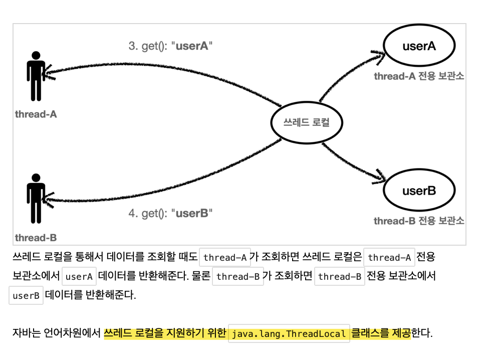

# 섹션2) Thread Local

## 1. 로그 추적기 만들기

* v3
  * 뭐했는지 정확히 기억이 안 난다.
  * 그냥 완성
    * 완성했지만 동시성 문제가 발생한다.

* 동시성 문제
  * 브라우저에서 여러 번 호출을 하게 되면 기대와는 다르게 하나의 block으로 완성되게 나오는 게 아니라 끊겨서 나와서 보기가 매우 힘들다.
  * 싱글톤에서 해당 문제가 많이 발생한다.

## 2. 동시성 문제 예제 코드

### 2-1) 생성

> * [실습코드: FieldService](./src/../../src/test/java/hello/advanced/trace/threadlocal/code/FieldService.java)

  * test코드 폴더에 `threadlocal` > `code` 폴더 생성하고 `FieldService.java`를 생성하자.
  * 해당 코드의 로직은 간단하다.
    * 그냥 paramter 로 `name을` 입력받고, 해당 `name`을 지역변수인 `nameStore`에 저장하는 코드이다.
      * 그리고 해당 `nameStore`를 반환한다.
      * 이 때, `nameStore`를 set하는 부분과 get하는 부분 사이에 1초의 sleep이 존재한다.

### 2-2) 테스트

> * [실습코드: FieldServiceTest](./../src/test/java/hello/advanced/trace/threadlocal/FieldServiceTest.java)

* thread를 2개 만들어서 돌려보자.
* 이 때, `threadA`와 `threadB`사이에 sleep을 0.1초를 줘보자.
* 그러면 문제가 발생한다.
  * threadA와 threadB둘다 
  * `threadA` `nameStore`에 `threadB`의 값이 들어갔다.
    * 그 이유는 threadA에서 set하고 get하기 전까지 1초의 sleep이 존재하는데, threadA와 threadB사이에는 0.1초의 sleep이 존재하므로 threadB가 공유변수에 접근해서 해당 nameStore의 값을 수정하기 때문이다.

<br/>

* 이와 같은 현상은 싱글톤에서 자주 발생한다.
  * 당연하게도, 읽기만 할때에는 발생하지 않으며, 값을 어디선가 변경할 때 발생한다.
  * 당연하게도, 지역 변수에서는 발생하지 않는다. 지역 변수는 쓰레드마다 각각 다른 메모리 공간이 할당되기 때문이다.
    * `static` 같은 공용 필드에 접근할 때 발생한다.

## 3. Thread Local

### 3-1) 쓰레드 로컬이란

* 해당 문제는 ThreadLocal로 해결할 수 있다.
* 쓰레드 로컬은 `물건 보관 창구` 라고 생각하면 좀 더 쉽게 기억할 수 있다.



* 중간에서 각 쓰레드마다 변수를 관리해주는 라이브러리이다.
* 각 쓰레드의 이름을 기억해서 변수를 관리해준다고 생각하면 될 것 같다.

### 3-2) 사용 방법

```java
ThreadLocal<String> threadLocal = new ThreadLocal<>();
```

* 값 저장
  * `ThreadLocal.set(해당 값)`
* 값 조회
  * `ThreadLocal.get()`
* 값 삭제
  * `ThreadLocal.remove()`

## 4. 유의사항

* 쓰레드 로컬을 사용하고 난 뒤에는 반드시 Thread.remove()를 통해 해당 쓰레드 공간을 삭제해야 한다.
* 쓰레드 로컬은 `ThreadA` - `ThreadA 저장소` 에 할당하는 식이다.
* 쓰레드 작동이 끝나고 `ThreadA`가 `ThreadPool`로 반환되도 `ThreadA` 저장소에 남아있는 데이터는 삭제되지 않는다.
  * 고로 다음 작업 시에 다른 사용자가 `ThreadA`를 사용 시, 전 사용자의 data를 조회할 수 있는 치명적인 에러가 생성될 수 있다.