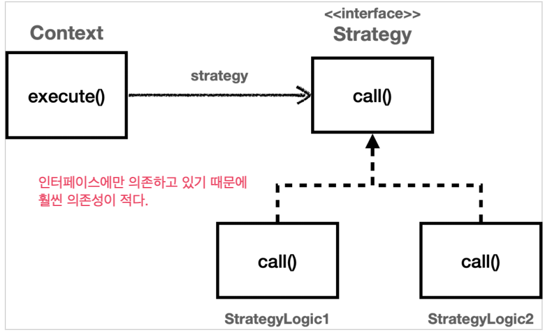

# 템플릿메서드 전략 콜백

## 1. 템플릿 메서드 문제상황

> [현재 문제상황](../src/main/java/hello/advanced/app/v3/OrderControllerV3.java)

```java
TraceStatus status = null;
try {
    status = trace.begin("OrderController.request()");
    **orderService.orderItem(itemId);**
    trace.end(status);
    return "ok";
} catch (Exception e) {
    trace.exception(status, e);
    throw e; //예외를 꼭 다시 던져주어야 한다.
}
```
* 문제상황
  * 주요로직은 한 줄밖에 안되는데, 로깅찍으려는 코드가 한 바닥이다.
  * 템플릿 메서드는 이런 문제를 해결할 수 있다.

* 핵심기능 vs 부가기능
  * 핵심기능은 비지니스 로직, 해당 객체가 제공하는 고유의 기능이다.
  * 부가기능은 로깅이나 트랜잭션 등이다.
    * 단독으로는 사용되지 않는다.

* 좋은설계
  * 좋은 설계는 변하는 것과 변하지 않는 것을 분리하는 것이다.
  * 해당 문제에서 변하는 것은 비지니스 로직, 변하지 않는 것은 로깅이다.
    * 즉, 변하지 않는 로깅을 분리하는 것이 필요해보인다.

## 2. 템플릿 메서드 도입

### 2-1) 템플릿 메서드 설명

> * [subclass1](../src/test/java/hello/advanced/trace/template/code/SubClassLogic1.java)
> * [subclass2](../src/test/java/hello/advanced/trace/template/code/SubClassLogic2.java)
> * [실행](../src/test/java/hello/advanced/trace/template/code/../TemplateMethodTest.java)

* 요약
  * 간단히 말하면 그냥 변하지 않는 부분은 부모 클래스에 두고, 클래스에 따라서 다르게 구현하는 부분만 따로 overriding해서 구현하는 방법이다.
  * 즉, **다형성** 을 이용해서 변하는 부분과 변하지 않는 부분을 구분하는 방법이라고 볼 수 있다.

### 2-2) 익명 내부 클래스

> * [templateMethodV2() 메서드 참조](../src/test/java/hello/advanced/trace/template/code/../TemplateMethodTest.java)

* 필요성
  * 템플릿 메서드를 활용하면 구현체에 따라서 매번 클래스를 새로 생성해야 되는 단점이 있다.
  * 이는 익명 클래스를 활용해서 해당 단점을 보완할 수 있다.

* 익명 내부 클래스 설명
  * 그냥 별거 없다. 내부 구현체를 위한 클래스를 새로 생성하지 않고, 익명 클래스로 던지는 방식이다.
  * 이 때, 해당 익명클래스를 `getClass()`로 찍어보면 java가 내부적으로 `해당 클래스$1` 과 같이 임의로 이름을 준다.
    * ex) `class hello.advanced.trace.template.TemplateMethodTest$1`

### 2-3) 템플릿 메서드의 장점

* 좋은 설계란?
  * 좋은 설계란 변경이 일어날 때 진가를 드러낸다.
* SRP(Single Reponsibility Principle)
  * 템플릿 메서드를 사용함으로써 얻는 이점은 SRP를 지킨다는 것이다.
  * 즉, 변경 지점을 하나로 모아서 변경에 쉽게 대처할 수 있다는 것이 큰 장점이다.

### 2-4) 템플릿 메서드 요약

* GOF 디자인 패턴의 정의
  * 작업에서(상위 클래스) 알고리즘의 골격을 정의하고, 일부 단계를 하위 클래스(자식 클래스)로 **연기**한다.
  * 템플릿 메서드를 사용하면 알고리즘 특정 단계를 재정의 할 수 있다.
  * 즉, `overriding` 과 상속의 다형성을 통해 문제를 해결하는 것이다.

### 2-5) 템플릿 메서드의 단점

* 템플릿 메서드 단점
  * 그러나 이런 템플릿 메서드는 치명적 단점이 존재한다.
  * 바로, 상속에서의 단점을 그대로 답습한다는 것이다.
  * 상속에서의 문제는 컴파일 타임에 부모 클래스와 자식 클래스가 강하게 결합된다는 것이다.
    * 자식 클래스 입장에서 부모 클래스를 전혀 사용하지 않더라도 강하게 의존한다.
      * 즉, 자식 클래스의 코드에 부모 클래스의 코드가 명확히 적혀져 있다.
      * 이는 결합도를 증가시킨다.

* 전략 패턴으로 한계 극복
  * 템플릿 메서드와 비슷한 역할을 하면서 상속 단계의 단점을 제거할 수 있는 패턴이다.

## 3. 전략(Strategy) 패턴

> * [전략패턴 내부동작](../src/test/java/hello/advanced/trace/strategy/strategy/ContextV1.java)
> * [전략패턴 외부에서 주입](../src/test/java/hello/advanced/trace/strategy/ContextV1Test.java)

* 개념 정의
  * 전략 패턴은 변하지 않는 부분은 `context`에 두고, 변하는 부분은 `strategy`라는 **인터페이스**에 두어서 문제를 해결한다.
  * 이는 상속이 아니라 위임으로 문제를 해결하는 것이다.

* 쉽게 설명하면 다음과 같다.
  * 내부 구현 클래스(예제에서 `ContextV1`)에서는 interface로 외부 비지니스 로직을 실행한다.
  * `ContextV1` 에 인터페이스를 제외한 나머지 코드에는 변하지 않는 부분, 로깅과 같은 코드들이 존재한다.
  * 외부 클래스(`ContextV1Test`) 에서는 해당 구현체를 주입해준다.

 

* GOF 설명
  * 각각을 캡슐화해서 상호작용 가능하게 만들자.
  * 전략을 사용하면 client와 사용하는 알고리즘을 독립적으로 변경하게 만들 수 있다.

* Spring
  * Spring에서 의존관계를 주입하는 방식이 바로 이 전략패턴이다.